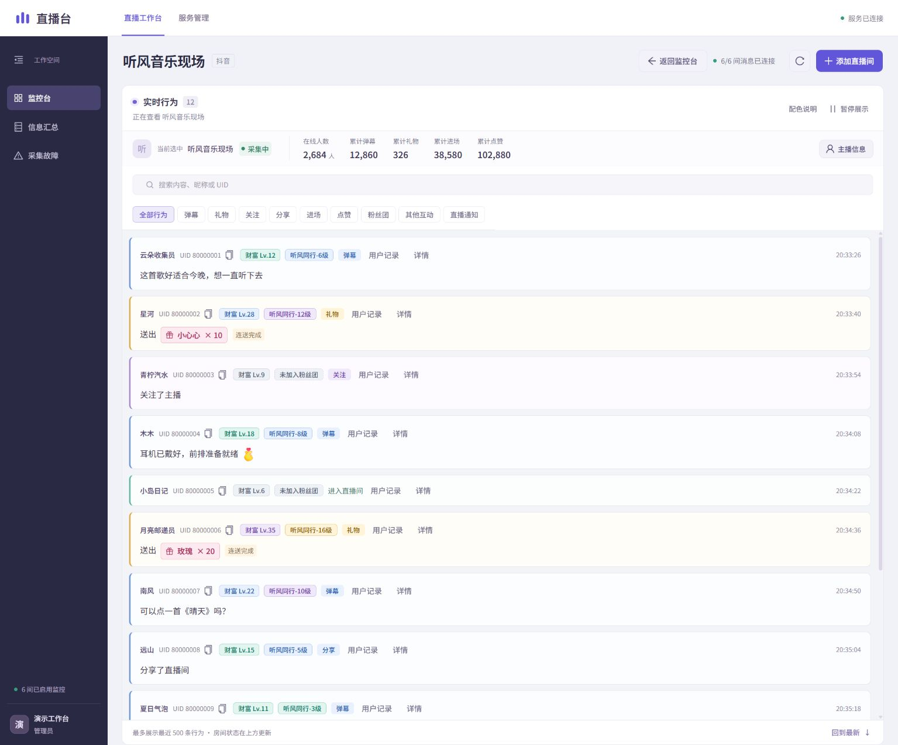
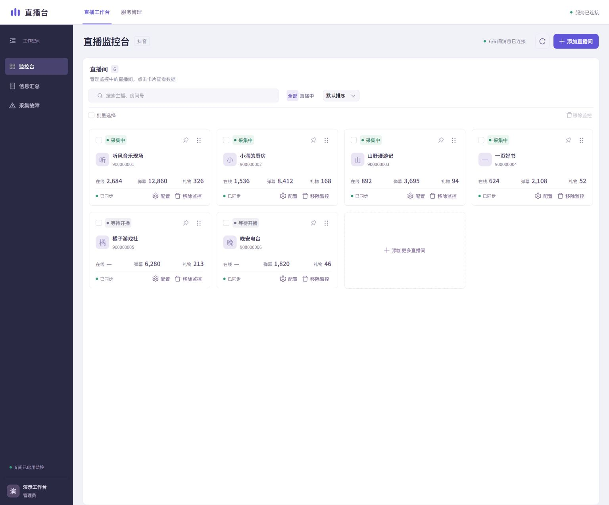
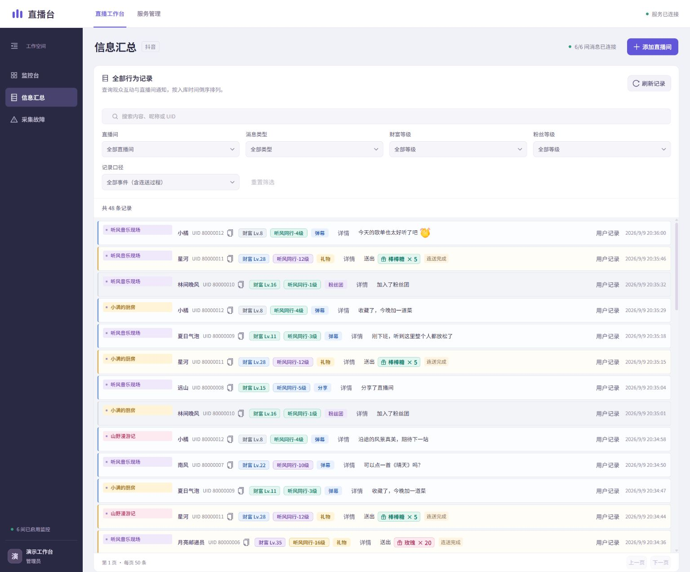

# DouyinDanmu

用于采集、保存和查看多个抖音直播间消息的本地监控工作台，提供 Windows 便携版和 Docker Compose 两种运行方式。

<p align="center">
  <a href="https://github.com/LiukerSun/DouyinDanmu/releases/latest">下载 Windows 便携版</a> ·
  <a href="#界面预览">界面预览</a> ·
  <a href="#windows-便携版">快速开始</a> ·
  <a href="#docker-compose">Docker 部署</a> ·
  <a href="#websocket-接入">WebSocket 接入</a>
</p>

[](assets/screenshots/live-messages.jpg)

<p align="center"><sub>实时查看弹幕、礼物与观众互动。截图来自当前 Web 工作台，房间、用户和消息均为虚构演示数据。</sub></p>

## 功能

- 管理多个直播间，支持搜索、排序、批量启停和独立采集状态。
- 展示弹幕、礼物、关注、分享、进场、点赞、粉丝团和已识别的直播通知。
- 查看主播资料、在线人数、在线观众贡献榜、累计互动指标、用户记录及历史消息。
- 按每次开播划分直播场次，统计每场收入钻石、峰值观看、弹幕与礼物数量。
- 按直播间配置 Cookie，使用管理员账号登录工作台。
- 使用 C++ / Protobuf 解析消息，将事件、原始载荷和解析详情持久化到 SQLite。
- 采集数据先写本地缓冲，确认入库后回收；支持重试、去重和断线后的增量订阅。
- 每个直播间使用独立的逻辑 WebSocket channel 和恢复游标。
- 普通模式展示观众行为和房间状态；debug 模式提供协议详情与未知字段结构分析。

最新字段扩展、无 schema 候选解释及历史详情重解析方式见 [Protobuf 解析说明](backend/proto/README.md)。

进入单个直播间后，点击“本房间排行榜”查看弹幕榜和礼物榜，按今天、近 7 天或全部已采集记录筛选；榜单和用户明细均限定在该房间。切换到“直播场次”按每次开播查看场次列表（开播时间、状态、收入钻石、峰值观看），场次详情内含弹幕记录、礼物记录与贡献榜。参数、统计口径、场次划分和历史回填说明见 [观众统计接口](backend/pipeline/analytics-api.md)。

## 界面预览

从多房间总览进入单个直播间，再到跨房间的历史记录查询。点击截图可查看原图。

<table>
  <tr>
    <th width="50%">多房间监控</th>
    <th width="50%">信息汇总与历史检索</th>
  </tr>
  <tr>
    <td><a href="assets/screenshots/overview.jpg"></a></td>
    <td><a href="assets/screenshots/message-archive.jpg"></a></td>
  </tr>
  <tr>
    <td>集中查看各房间状态与互动指标，支持搜索、排序、重点关注和批量管理。</td>
    <td>汇总多个直播间的行为记录，支持关键词、消息类型、等级筛选及用户记录查询。</td>
  </tr>
</table>

## Windows 便携版

[下载 v2.1.3 Windows 便携包](https://github.com/LiukerSun/DouyinDanmu/releases/download/v2.1.3/DouyinDanmu-win-x64-portable.zip) · [SHA256 校验文件](https://github.com/LiukerSun/DouyinDanmu/releases/download/v2.1.3/DouyinDanmu-win-x64-portable.zip.sha256) · [Release 页面](https://github.com/LiukerSun/DouyinDanmu/releases/tag/v2.1.3)

系统要求：**Windows 10（1903 或更新版本）/ Windows 11，x64**。运行环境已包含在发布包中，无需安装 Docker、Node.js、数据库或编译器。

1. 将 ZIP 完整解压到有写入权限的目录。
2. 双击 `start.cmd`，浏览器会打开 [本地工作台](http://localhost:3000)。
3. 首次访问创建管理员账号，然后添加直播间号或直播链接。

“暂停”保留房间卡片，方便随时启动；“删除”在确认后停止采集并移出监控列表，支持单个或批量操作。删除保留历史记录和房间配置，重新添加相同房间号可继续使用。

v2.1.3 修复礼物连送重复计数与明细显示：同组累计 1～10 只计 10 个，明细分别显示本次新增和原始上报数量。已有错误历史请按 [历史连送分组修复](backend/pipeline/analytics-api.md#历史连送分组修复) 停机预览、备份并修复。

请从解压后的目录运行，保留包内的 `app`、`bin`、`runtime` 和 `web` 目录。首次启动无需下载运行依赖，采集直播需要联网。

| 命令 | 用途 |
| --- | --- |
| `start.cmd` | 普通模式启动并打开网页 |
| `start-debug.cmd` | 开启协议诊断 |
| `stop.cmd` | 停止程序，保留数据 |
| `start.cmd --port 3001` | 指定网页端口 |
| `start.cmd --no-browser` | 启动服务，不自动打开浏览器 |

也可在启动窗口按 Ctrl+C 停止。同一解压目录只能运行一个实例；服务仅监听本机地址。

## Docker Compose

需要 Docker Engine / Docker Desktop 和 Docker Compose。Windows 的 Docker Desktop 应使用 Linux containers。在仓库根目录运行：

```bash
docker compose up -d --build
```

启动后访问 [本地工作台](http://localhost:3000)，创建管理员账号并添加直播间。

```bash
# 查看服务状态
docker compose ps

# 停止服务，保留数据
docker compose stop

# 恢复服务
docker compose up -d
```

开启协议诊断：

```bash
docker compose -f compose.yaml -f compose.debug.yaml up -d --build
```

恢复普通模式：

```bash
docker compose -f compose.yaml up -d
```

Windows 也可使用 `./start.ps1 -DebugMode` 或 `./start.ps1`。切换模式后刷新页面。

Compose 包含网页入口、登录服务、采集器、C++ 后端、RabbitMQ 和 Redis，默认向本机开放网页端口 `3000` 和 RabbitMQ 管理端口 `15673`。便携版使用本地投递与 SQLite 统计，不需要这些外部服务。

## 数据与备份

便携版的数据保存在解压目录下：

| 路径 | 内容 |
| --- | --- |
| `data/pipeline.db` | 房间、消息、统计和解析详情 |
| `data/auth/` | 管理员账号资料 |
| `data/config/rooms/` | 每个直播间的 Cookie 配置 |
| `data/spool/` | 待确认入库的采集缓冲 |
| `data/spool/quarantine/` | 中断写入后无法完整恢复的文件；独立保留，不占活动采集缓冲配额 |
| `data/.runtime/` | 运行锁及本机控制信息 |
| `logs/` | 运行日志 |

备份或升级前先停止程序，再复制**整个 `data/` 目录**。升级时，将备份的数据目录放入新版解压目录后启动。不要只复制正在使用的 SQLite 文件，运行期间可能同时存在 WAL/SHM 文件。

Docker 使用 `backend-data`、`collector-data`、`auth-data` 和 `rabbit-data` 命名卷。备份前停止 Compose 服务，并备份这些卷；实际卷名带有 Compose 项目前缀。`docker compose down -v` 会删除命名卷中的数据，不应作为普通停机命令。

Cookie、账号资料、数据库和日志可能包含私人信息，请保存在受控目录中，不要提交到源码仓库或加入分发包。Docker 与便携版的数据不会自动迁移。

缓冲写满时，房间会通过独立心跳显示“缓冲已满”；投递恢复后自动继续采集。无法恢复的临时文件保留在上述隔离目录，数量与体积显示在“服务运行状态”，维护时可随整个数据目录备份检查。旧版本礼物统计若受展示价格或时间影响，可使用默认只读、执行前备份的 [`--repair-gift-facts` 维护命令](backend/pipeline/analytics-api.md#数据维护与性能)。

## WebSocket 接入

入口为 `ws://localhost:3000/ws`，需要有效的工作台登录会话。通过 HTTPS 部署时使用 `wss://`。同源浏览器会自动携带会话 Cookie。

**每个直播间按 `live_id` 建立独立逻辑 channel。** 一条 WebSocket 最多订阅 32 个直播间，每间房分别维护游标；退订一个房间不影响其他订阅。

以下示例在已登录工作台的同源页面运行，将 `liveId` 替换为已添加的直播间号：

```javascript
const liveId = '123456789';
const response = await fetch(`/api/rooms/${liveId}/snapshot`);
if (!response.ok) throw new Error('读取房间快照失败');
const snapshot = await response.json();
let cursor = snapshot.through_seq;
// 使用 snapshot.events 和 snapshot.state_events 初始化界面。
const scheme = location.protocol === 'https:' ? 'wss:' : 'ws:';
const socket = new WebSocket(`${scheme}//${location.host}/ws`);

socket.addEventListener('open', () => {
  socket.send(JSON.stringify({
    action: 'subscribe', live_id: liveId, after_seq: cursor,
  }));
});
socket.addEventListener('message', ({ data }) => {
  const batch = JSON.parse(data);
  if (batch.type !== 'event_batch' || batch.live_id !== liveId) return;
  console.log(batch.events, batch.state_events);
  cursor = batch.through_seq;
});
// 退订：socket.send(JSON.stringify({ action: 'unsubscribe', live_id: liveId }));
```

服务端通过 `subscribed` 确认订阅，通过 `event_batch` 返回增量。`events` 用于行为展示，`state_events` 用于更新房间指标。每次处理完批次后都应保存 `through_seq`，即使该批没有展示消息；重连后用保存的游标再次订阅。UID 和游标使用字符串，避免 64 位整数精度丢失。

## 从源码构建

Docker 方式使用前述 `docker compose up -d --build`，构建入口位于 [`docker/`](docker)。

构建 Windows 便携包需要 Windows x64、PowerShell、MinGW-w64 UCRT（`gcc`、`g++`、`windres`）、CMake 3.20+ 和 Ninja，并将工具加入 PATH。在仓库根目录运行：

```powershell
powershell -ExecutionPolicy Bypass -File portable/build-windows.ps1
```

[`portable/build-windows.ps1`](portable/build-windows.ps1) 下载并校验固定版本 Node.js，编译后端、启动器与前端，生成 ZIP 和校验文件。构建需要联网，输出位于 `release/`。可通过 `-OutputDirectory` 指定尚不存在的输出目录，通过 `-Jobs` 指定编译并行数。

## 使用限制

- 仅能保存采集连接实际收到的消息；平台未下发、网络中断或协议变化可能造成数据缺失。
- 平台只向已登录会话推送礼物消息：未配置 Cookie 的房间可能完全收不到礼物记录，在房间内配置已登录账号的 Cookie 后恢复。
- 平台风控会导致连接只剩心跳、误判直播间未开播或礼物中途消失；同一账号的 Cookie 同时监听过多房间会加剧风控。遇到时应减少并发房间、停用数天或更换网络出口。
- 部分消息仅能解析字段结构，未知字段的业务含义不一定已确认。协议状态保存在后端，普通行为列表不会展示所有消息类型。
- 程序采用单机存储和单管理员工作空间，未提供多租户权限或多机高可用。
- 历史数据会持续增长，没有自动清理策略，需要定期检查磁盘空间并备份。
- 默认配置面向本机使用；对外部署需配置 HTTPS、允许来源和独立的服务凭据。

## 第三方许可

运行时及构建依赖包含 Node.js、Protobuf、Boost、SQLite、zlib、React、HeroUI 等组件，其许可文件随便携包保存在 `licenses/`。中文字体许可见 [`OFL-NotoSansSC.txt`](frontend/public/licenses/OFL-NotoSansSC.txt)，原生工具链许可见 [`portable/licenses/`](portable/licenses)。使用和分发时应保留对应许可文件。

## 致谢

本项目受到以下项目的启发：

- [saermart/DouyinLiveWebFetcher](https://github.com/saermart/DouyinLiveWebFetcher) — 原始 Python 版本，JavaScript 签名算法来源于该项目。
